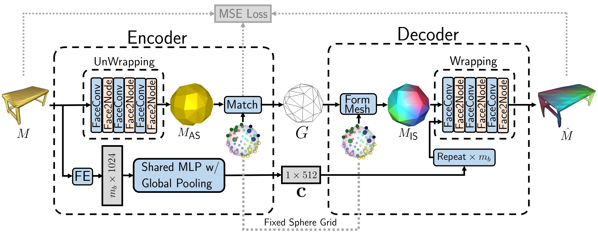

# WrappingNet

Implementation of the WrappingNet architecture.<br>
The entire framework is illustrated below.



## Data Preparation
The dataset for WrappingNet should be prepared as follows:
### For training
1. `mkdir -p datasets/Manifold40; cd datasets/Manifold40`
2. Download processed.zip from `https://aspera.pub/3O5IeFo` then move into `datasets/Manifold40/`
3. `unzip processed.zip`, then check the data under `datasets/Manifold40/processed/`
### For evaluation
4. `wget https://cg.cs.tsinghua.edu.cn/dataset/subdivnet/datasets/Manifold40.zip`
5. `unzip Manifold40.zip`
6. `mv Manifold40 raw` then check the data under `datasets/Manifold40/raw/`

## Dependencies
```
   pytorch
   pytorch-geometric
   pytorch-lightning
   pytorch-scatter
   botorch
   open3d
   numpy
```

## To Run
To use our generalized face convolutions, follow these steps:
1. Create a python environment with the above dependencies installed
2. Go to `./nndistance/` and run `python build.py install`. This will build the faster chamfer distance module.
3. Run `CUDA_VISIBLE_DEVICES={GPU}, bash scripts/LC.sh` or `CUDA_VISIBLE_DEVICES={GPU}, bash scripts/basesup3.sh` to launch a training script.

## Citation
Eric Lei, Muhammad Asad Lodhi, Jiahao Pang, Junghyun Ahn, Dong Tian, <br>
"*WrappingNet: Mesh Autoencoder via Deep Sphere Deformation*", <br>
To Appear in 2024 IEEE International Conference on Image Processing (ICIP).
